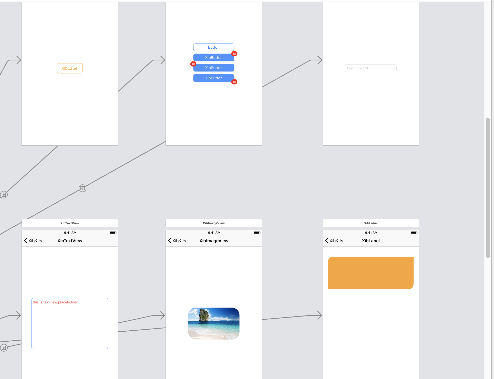

<p align="center">

</p>

<a href="https://github.com/RainManGO/XibKits"></a>
<a href="https://github.com/RainManGO/XibKits"></a>
[](https://cocoapods.org/pods/XibKits)
[](https://github.com/RainManGO/XibKits/blob/master/LICENSE)
[](https://cocoapods.org/pods/XibKits)

## Example
<p>

</p>

To run the example project, clone the repo, and run `pod install` from the Example directory first.

## 🌟 Features

- [x] UIView cornerRaduis shadow
- [x] UIButton border & raduis & badge
- [x] UIImageView raduis
- [x] UITextFeild limitwords
- [x] UITextView placeholder
...

## Installation

XibKits is available through [CocoaPods](https://cocoapods.org). To install
it, simply add the following line to your Podfile:

```ruby
pod 'XibKits'
```
## Usage


## Author

zy, 776210576@qq.com

## License

XibKits is available under the MIT license. See the LICENSE file for more info.

## Wishes

You can add more xib in your work，build toghter
